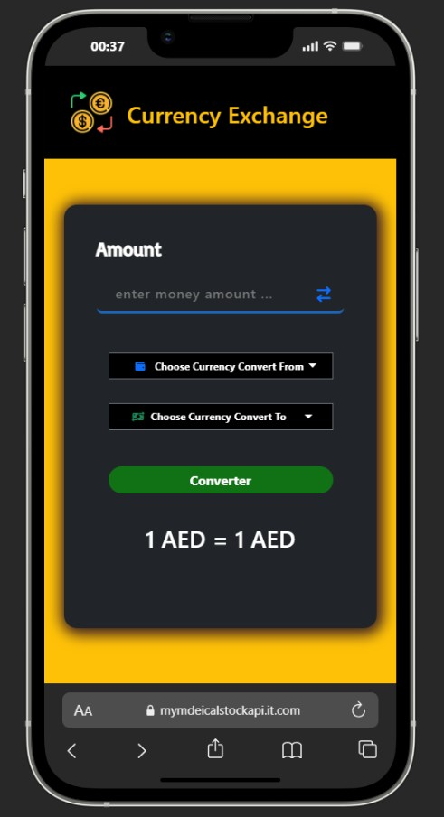
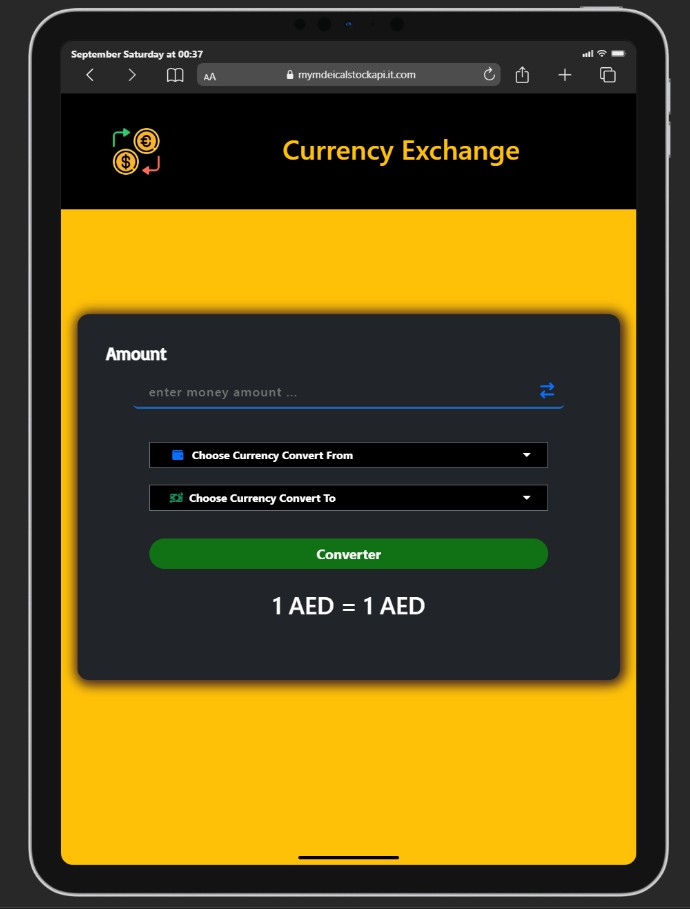
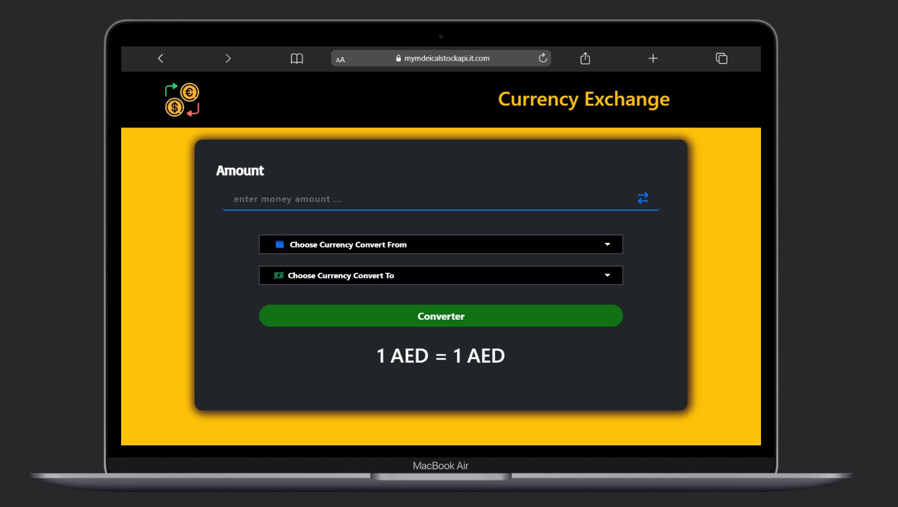

# JS Currency Exchange App

A simple **JavaScript Currency Exchange App** to convert currencies using [ExchangeRate-API](https://www.exchangerate-api.com/).

---

## 💻 Features

- Convert between currencies.
- Select currencies with flags.
- Swap currencies.
- Input validation.
- Fetch live rates from ExchangeRate-API.

---

## ⚙️ Technologies

- HTML5, CSS3 & Bootstrap
- JavaScript (ES6)
- ExchangeRate-API
- Font Awesome

---

## 📝 Setup

1. Clone the repo:
   ```bash
   git clone https://github.com/ehab-elshimi/js-currency-exchange-app.git
Open index.html in browser.

Replace API_KEY in js/main.js with your key.

🔧 How It Works
Choose currencies.

Enter amount.

Click Convert.

Use swap button if needed.

📄 License
MIT License

📷 Screenshots
<div align="center">    </div> ```
